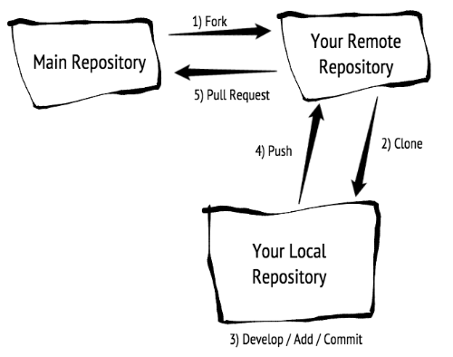

# Basic Git/Github Workflow

## Setting up a Repository

### Starting a new project

1. Create project directory on local machine
1. In terminal, navigate to newly created directory
1. Create a new git repo: `git init`
1. Add a *readme.md* file that states what the project is all about: `touch readme.md`
1. Add a *.gitignore* file: `touch .gitignore`
1. Add files to staging: `git add -A` (taking a snapshot)
1. Add files (snapshot) to local repo: `git commit -am "commit message"`
1. Go to [Github](http://www.github.com) and add a new repository
1. After you create repo, copy the "remote add" line, then paste back within your project directory in your terminal
1. Now push your local repo to Github: `git push origin master`

### Updating an existing project

1. After you make your updates, add files to staging `git add -A` (taking a snapshot)
1. Add files (snapshot) to local repo: `git commit -am "commit message"`
1. Now push your local repo to Github: `git push origin master`

## Forking Workflow

1. Start by forking the main repository to create your own remote repository
1. Clone down your remote repository: `git clone SSH_CLONE_URL`
1. Develop locally
1. Once done, add files to staging: `git add -A` (taking a snapshot)
1. Add files (snapshot) to local repo: `git commit -am "commit message"`
1. Now push your local repository to the remote rep on Github: `git push origin master`
1. Finally, create a [Pull Request](https://help.github.com/articles/creating-a-pull-request/) against the main repository

